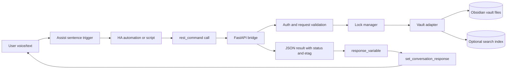
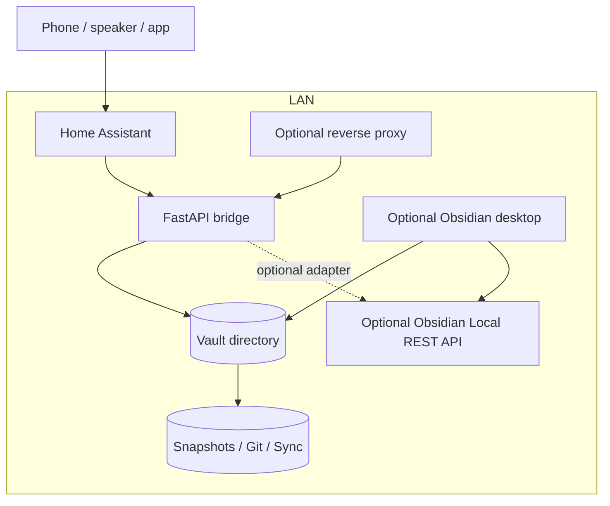

# Home Assistant Assist to Obsidian Bridge with FastAPI

## Executive summary

The cleanest first version is a LAN-local bridge in which entity["software","Home Assistant","home automation platform"] Assist captures the command, a sentence-triggered automation or script calls a small entity["software","FastAPI","Python web framework"] service through `rest_command`, the service reads or writes Markdown in an entity["software","Obsidian","knowledge base app"] vault, and the automation speaks the result back with `set_conversation_response`. That path uses native Home Assistant features that already expose sentence wildcards, HTTP action responses, and templated conversation replies, while matching Obsidian’s plain-text vault model and frontmatter-based metadata. citeturn29view1turn22view0turn33view0turn33view2turn31search5turn18view2

For your stated environment, direct filesystem access should be the default vault adapter. Obsidian stores notes locally as Markdown files inside a vault folder, so a service on the same LAN server can work without requiring the desktop app to stay open. Add the community plugin entity["software","Obsidian Local REST API","community plugin for Obsidian"] only if you specifically need section-level patching, command execution, or parity with an already-running Obsidian desktop instance. Treat entity["software","Obsidian Sync","synchronization service for Obsidian"], entity["software","Obsidian Publish","publishing service for Obsidian"], and the community plugin entity["software","Obsidian Git","community plugin for Git integration in Obsidian"] as replication, publishing, or backup layers—not as the primary write API for voice automation. citeturn31search5turn31search3turn8view1turn18view0turn18view1turn20view0turn8view2

This design and plan are grounded mainly in urlHome Assistant voice and automation docsturn28search14, urlHome Assistant REST and auth developer docsturn13search18, urlObsidian Helpturn6search13, urlFastAPI docsturn10search0, the maintainer docs for urlobsidian-local-rest-apiturn2search0, and the maintainer docs for urlobsidian-gitturn2search1.

## Goals and assumptions

The bridge should do five things well. It should accept simple Assist-driven read and write operations with low latency. It should preserve Obsidian-native file semantics so the vault remains editable by humans and other tools. It should fail safely under concurrent edits. It should be easy to secure on a home LAN and still defensible if remote access is later added. It should leave room for later search and LLM retrieval without forcing an LLM dependency now. citeturn29view1turn33view0turn33view2turn31search5turn18view4turn8view1

The explicit assumptions from your prompt are that Home Assistant exists, the Obsidian vault is reachable from a LAN server, the OS is unspecified, and running a FastAPI service is acceptable. The main working assumptions I am adding because they were not specified are these: one vault is the primary target; the first release is LAN-only; the bridge must not require the Obsidian desktop app to be running; notes remain Markdown-first and human-editable; and you want an implementation that can later gain semantic search without changing the write path. These are design assumptions, not facts.

A few unspecified items materially affect implementation details and should be treated as toggles in the plan: whether you already have a reverse proxy, whether the vault is also being changed by Sync or Git automation on the same host, whether multiple human editors often touch the same notes during the day, whether you want section-level writes into headings, and whether you want the bridge confined to one folder such as `Inbox/` or `Daily/` before widening scope.

For metadata, keep frontmatter flat. Obsidian stores properties in YAML frontmatter, supports structured types such as text, list, number, date, and tags, but currently does not support nested properties in the normal properties UI. That makes flat keys such as `ha_context_id` and `source` safer than nested structures such as `ha.context.id`. citeturn18view2

## Recommended architecture

The recommended starting architecture is:

1. Assist command enters Home Assistant through a sentence trigger.
2. A Home Assistant script calls the bridge with `rest_command`.
3. The bridge authenticates the request, validates the vault-relative path, acquires a per-note lock, reads or writes the Markdown file atomically, and returns structured JSON including an `etag` and any conflict state.
4. The Home Assistant script uses `response_variable` and `set_conversation_response` to speak success or failure back to the user. This works with native Assist and local sentence handling. Sentence triggers only work with the default conversation agent unless “Prefer handling commands locally” is enabled when using an external agent, which matters if you later mix this with other conversation backends. citeturn29view1turn22view0turn33view0turn33view2



Keep the bridge and the vault on the same host if you can. When the service runs next to the vault, direct filesystem writes are simpler, faster, and less brittle than driving a GUI app indirectly. If you later need heading-level patch semantics, plug in an alternate adapter that talks to the Obsidian Local REST API plugin; that plugin already supports precise reads and writes against headings, block references, and frontmatter fields, and it serves HTTPS with API key authentication. citeturn31search5turn8view1



### Component list

| Component | Responsibility | Recommended implementation |
|---|---|---|
| Voice entry | Capture natural-language command | Home Assistant sentence trigger |
| Orchestration | Convert slot values into HTTP call and spoken reply | Home Assistant script + automation |
| API surface | Validate requests and emit structured JSON | FastAPI app |
| Auth layer | Authenticate caller and authorize operations | API key first, optional OAuth2 or mTLS later |
| Vault adapter | Read/write Markdown and frontmatter | Direct filesystem first |
| Optional advanced adapter | Section-level patching and desktop-aware operations | Obsidian Local REST API plugin |
| Lock manager | Serialize concurrent edits per note | In-process mutex + cross-process file lock |
| Search adapter | Lexical search now, semantic retrieval later | Filesystem scan or `rg` now; embeddings later |
| Audit and ops | Logs, metrics, health, backups | Structured JSON logs + `/v1/health` + snapshots |

## Access methods and authentication

Among the viable access layers, the important options are direct file access to the Obsidian vault, the Obsidian Local REST API plugin, entity["software","Obsidian CLI","command line interface for Obsidian"], Obsidian Sync and Headless Sync, Obsidian Publish and Headless Publish, and the Obsidian Git plugin. Their roles are not interchangeable. Obsidian’s own docs emphasize local Markdown storage and distinguish desktop-controlled CLI, sync, and publish workflows; the community plugin docs add a true note API. citeturn31search5turn31search3turn18view5turn20view1turn18view0turn18view1turn8view1

### Obsidian access methods

| Method | Server fit | Best use | Main limits | Recommendation | Basis |
|---|---|---|---|---|---|
| Direct filesystem | Excellent | Primary read/write bridge on LAN server | You must implement locking, atomic writes, and search yourself | **Default choice** | citeturn31search5turn31search3turn18view2 |
| Obsidian Local REST API plugin | Good if Obsidian desktop is running on the same host | Precise heading/frontmatter patches, command execution, richer Obsidian-aware operations | Requires community plugin, API key, trusted self-signed cert or explicit cert handling | **Good optional adapter** | citeturn8view1 |
| Obsidian CLI | Weak for a headless bridge | Desktop-driven scripting and developer workflows | Obsidian app must be running | **Not primary for this bridge** | citeturn18view5turn20view1 |
| Obsidian Sync / Headless Sync | Good for replication | Off-host copy, shared vault replication, recovery aid | Not a note API; do not combine desktop Sync and Headless Sync on the same device | **Secondary replication layer only** | citeturn18view0turn20view0turn18view6 |
| Obsidian Publish / Headless Publish | Good for publishing | Website or doc-site publication | Not a private write API for automations | **Not for bridge writes** | citeturn18view1turn20view2 |
| Obsidian Git plugin | Good for backups/audit | Version control, scheduled commit/pull/push | Not a request/response note API | **Use as backup/audit, not primary API** | citeturn8view2 |

The decisive trade-off is simple: if the vault is already available on the server, direct filesystem access minimizes moving parts. If you later need targeted edits like “append this line under heading X without rewriting the whole file,” the Local REST API plugin is the most capable adapter because it already exposes exact operations for headings, block references, and frontmatter fields. citeturn31search5turn8view1

### Authentication choices

| Option | Best fit here | Strengths | Weaknesses | Recommendation | Basis |
|---|---|---|---|---|---|
| API key header | Home Assistant calling an internal bridge | Simple, OpenAPI-friendly, easy to store in HA secrets | Coarse-grained unless you add key scopes/roles yourself | **Best starting point** | citeturn10search1turn25search3 |
| OAuth2 bearer tokens | Multiple human users, browser clients, future admin UI | Standard user auth, token expiry, optional scopes | More moving parts than HA needs for a simple bridge | **Use only if you add external users/UI** | citeturn10search5turn25search2turn25search22turn25search6 |
| mTLS | Machine-to-machine traffic across trust boundaries | Strong client identity at transport layer | Certificate lifecycle and proxy setup overhead | **Excellent for remote or zero-trust LAN** | citeturn25search0turn25search13 |
| Home Assistant long-lived tokens | Bridge calling Home Assistant APIs | Native HA identity; useful for integrations and webhook-style automation | Very long lifetime; should not be your general bridge auth mechanism | **Use only for bridge→HA calls** | citeturn16view4turn16view5turn23view1 |

For LAN-only initial deployment, use an API key in an `X-API-Key` header and rotate it periodically. For remote access, do not expose the raw FastAPI port. Put the bridge behind a reverse proxy such as entity["software","Nginx","web server and reverse proxy"] or entity["software","Traefik","reverse proxy"], terminate TLS there, and add either mTLS or OAuth2 depending on whether the remote caller is machine-only or human-interactive. FastAPI’s own deployment docs assume a proxy is common, and its middleware docs support host allowlists and strict CORS if you later add a browser client. citeturn27search14turn27search10turn27search0turn27search1turn25search0turn25search13turn26search0turn26search1

For Home Assistant webhooks, keep `local_only: true` unless you deliberately need inbound remote callbacks. Home Assistant’s webhook docs say local-only is the default, and remote webhook use should be paired with HTTPS. If you use entity["software","Node-RED","flow-based programming tool"] for any part of the flow, secure it explicitly; its own docs say the editor is unsecured by default and only suitable on a trusted network. citeturn16view3turn16view9

## API and data model

The bridge API should be JSON-first and body-addressed. That is slightly less “pure REST” than path-heavy resource URLs, but it makes Home Assistant templating much cleaner because note paths often contain slashes, spaces, dates, and Unicode. For this use case, operational simplicity beats strict resource purism.

### Endpoint summary

| Endpoint | Purpose | Notes |
|---|---|---|
| `GET /v1/health` | Readiness/liveness | Safe for HA health sensor |
| `POST /v1/notes` | Create a note | Optional frontmatter and initial content |
| `POST /v1/notes/read` | Read note by vault-relative path | Returns content, frontmatter, and `etag` |
| `POST /v1/notes/update` | Replace content or merge frontmatter | Uses optimistic concurrency via `expected_etag` |
| `POST /v1/notes/append` | Append to file or to a heading | Preferred write endpoint for voice capture |
| `POST /v1/search` | Lexical search now; semantic later | Filter by path prefix, tag, metadata |

### Canonical request and response JSON schemas

```json
{
  "$id": "CreateNoteRequest",
  "type": "object",
  "required": ["path"],
  "properties": {
    "path": { "type": "string", "description": "Vault-relative path, e.g. Daily/2026-05-09.md" },
    "title": { "type": "string" },
    "content": { "type": "string", "default": "" },
    "frontmatter": { "type": "object", "additionalProperties": true, "default": {} },
    "tags": { "type": "array", "items": { "type": "string" }, "default": [] },
    "overwrite": { "type": "boolean", "default": false },
    "create_parents": { "type": "boolean", "default": true }
  },
  "additionalProperties": false
}
```

```json
{
  "$id": "ReadNoteRequest",
  "type": "object",
  "required": ["path"],
  "properties": {
    "path": { "type": "string" },
    "include_content": { "type": "boolean", "default": true },
    "include_frontmatter": { "type": "boolean", "default": true }
  },
  "additionalProperties": false
}
```

```json
{
  "$id": "UpdateNoteRequest",
  "type": "object",
  "required": ["path"],
  "properties": {
    "path": { "type": "string" },
    "content": { "type": "string" },
    "frontmatter_merge": { "type": "object", "additionalProperties": true, "default": {} },
    "replace_frontmatter": { "type": "boolean", "default": false },
    "expected_etag": { "type": ["string", "null"], "default": null },
    "create_if_missing": { "type": "boolean", "default": false }
  },
  "additionalProperties": false
}
```

```json
{
  "$id": "AppendNoteRequest",
  "type": "object",
  "required": ["path", "content"],
  "properties": {
    "path": { "type": "string" },
    "content": { "type": "string" },
    "heading": { "type": ["string", "null"], "default": null },
    "create_heading_if_missing": { "type": "boolean", "default": true },
    "ensure_trailing_newline": { "type": "boolean", "default": true },
    "frontmatter_merge": { "type": "object", "additionalProperties": true, "default": {} },
    "expected_etag": { "type": ["string", "null"], "default": null }
  },
  "additionalProperties": false
}
```

```json
{
  "$id": "SearchRequest",
  "type": "object",
  "required": ["query"],
  "properties": {
    "query": { "type": "string" },
    "path_prefix": { "type": ["string", "null"], "default": null },
    "tags_any": { "type": "array", "items": { "type": "string" }, "default": [] },
    "limit": { "type": "integer", "minimum": 1, "maximum": 100, "default": 10 },
    "include_excerpt": { "type": "boolean", "default": true }
  },
  "additionalProperties": false
}
```

```json
{
  "$id": "NoteResponse",
  "type": "object",
  "required": ["path", "etag", "modified_at", "exists"],
  "properties": {
    "path": { "type": "string" },
    "exists": { "type": "boolean" },
    "etag": { "type": "string" },
    "title": { "type": ["string", "null"] },
    "frontmatter": { "type": "object", "additionalProperties": true },
    "content": { "type": "string" },
    "created_at": { "type": ["string", "null"], "format": "date-time" },
    "modified_at": { "type": "string", "format": "date-time" },
    "bytes": { "type": "integer" },
    "correlation_id": { "type": "string" }
  },
  "additionalProperties": false
}
```

```json
{
  "$id": "ErrorResponse",
  "type": "object",
  "required": ["error", "code", "correlation_id"],
  "properties": {
    "error": { "type": "string" },
    "code": { "type": "string" },
    "detail": {},
    "retryable": { "type": "boolean" },
    "correlation_id": { "type": "string" }
  },
  "additionalProperties": false
}
```

### Recommended note metadata

Obsidian properties live in YAML frontmatter, and the `tags` property should be a YAML list. Use that native model, not a sidecar database. Keep the bridge’s metadata minimal and flat so it remains useful inside Obsidian itself, and so search, bases, and community plugins can consume it naturally. citeturn18view2turn18view3turn9search15

```yaml
---
title: "2026-05-09 capture"
tags:
  - inbox
  - voice
  - home-assistant
source: "home_assistant_assist"
created_at: "2026-05-09T09:10:11Z"
updated_at: "2026-05-09T09:10:11Z"
ha_context_id: "01JTV..."
ha_device_id: "device_abc123"
conversation_id: "conv_456"
correlation_id: "req_789"
---
```

Use these frontmatter rules:

- `title`: friendly title if you do not want to derive it from file name.
- `tags`: YAML list, never a comma-separated string.
- `created_at` and `updated_at`: ISO 8601 UTC.
- `source`: fixed source marker such as `home_assistant_assist`.
- `ha_context_id`, `ha_device_id`, `conversation_id`, `correlation_id`: troubleshooting and audit hooks.
- `publish`: optional, only if you later use Obsidian Publish.
- Avoid nested structures and avoid dumping raw request JSON into frontmatter.

### Conflict resolution and locking

Because Obsidian vaults are plain files and may also be touched by humans, sync tools, or Git workflows, the bridge should use two concurrency controls at once: a per-note lock for serialization and an `etag` precondition for optimistic concurrency. The lock prevents simultaneous writes by your own service. The `etag` catches races against other editors or automation layers that changed the file after the caller last saw it. This is especially important if you later combine the bridge with file-based sync, Sync, or Git-based automations. citeturn32search3turn18view0turn8view2

The write algorithm should be:

1. Validate that the path is vault-relative and cannot escape the root.
2. Acquire a cross-process file lock specific to the note.
3. Read current bytes and compute `etag_before`.
4. If `expected_etag` is present and differs, return `412 Precondition Failed`.
5. Apply update or append operation.
6. Write to a temporary file in the same directory.
7. Atomically replace original with `os.replace`.
8. Re-read or stat the file, compute `etag_after`, and return it.

If you choose the Obsidian Local REST API adapter for some operations, use it for targeted edits such as heading append or frontmatter-key replace, because the plugin already exposes those surgical operations. Even then, keep the bridge’s own `etag` policy so Home Assistant gets consistent conflict behavior no matter which adapter is active. citeturn8view1

My recommended conflict policy is conservative:

- `append` without `expected_etag`: allowed, but serialized through lock.
- `update` with full content replacement: require `expected_etag`.
- `append` to specific heading: if heading missing, create it by default; make this configurable.
- On conflict, return `412` plus current `etag`, current `modified_at`, and optionally `current_excerpt`.
- Never auto-merge arbitrary Markdown beyond append-only scenarios.

### Error handling, rate limits, logging, and backups

Use these HTTP statuses consistently: `400` for invalid path or bad request shape, `401` for missing or invalid auth, `403` for disallowed operation, `404` for absent note, `409` for lock timeout or duplicate-create conflict, `412` for stale `etag`, `422` for invalid frontmatter shape, `429` for rate limit, `500` for internal failure, and `503` for vault unavailable or dependency down.

For rate limiting, the bridge does not need high throughput. A sensible starting policy is 30 write requests per minute per API key, 120 read/search requests per minute per API key, 300 health requests per minute per source IP, and a request-body cap of 256 KiB. Apply the hard limit at the reverse proxy and optionally a softer in-app limit for audit visibility. Reverse proxies like Nginx and Traefik both support request-rate limiting. citeturn26search0turn26search1

Logs should be structured JSON, never raw note bodies. At minimum log `timestamp`, `correlation_id`, `note_path`, `operation`, `status_code`, `latency_ms`, `etag_before`, `etag_after`, and a hash of the caller identity or API key ID. Keep a separate write-audit log if you want replay, but still avoid storing full note content there unless you deliberately accept the sensitivity trade-off.

For backups, do not rely on any single layer. Obsidian’s File recovery feature is useful but explicitly not a complete backup solution, and its snapshots are device-local. Obsidian Sync version history also has retention limits, and Headless Sync should not run on the same device as desktop Sync. For this bridge, the minimum safe stack is: full vault snapshot before rollout, daily local snapshots, and one off-host copy such as Git or a real backup tool. citeturn32search0turn32search2turn18view6turn20view0

### Future RAG and embedding path

Start with lexical retrieval, not embeddings. Obsidian already has strong search operators over note content, file names, paths, tags, and properties, and the Local REST API plugin adds full-text search plus Dataview DQL and JsonLogic options. That combination is usually enough for early “find my note” and “search my daily notes” use cases. citeturn18view4turn8view1

If you later add embeddings, keep them as a secondary index that is rebuilt from the authoritative Markdown files after successful writes. Chunk on headings and block-reference boundaries because Obsidian supports linking directly to both headings and blocks, which makes retrieval results easy to resolve back into native notes. Store the chunk text, note path, heading path, tags, aliases, created/updated timestamps, and `etag` in the embedding index. Re-index only changed files after each write. citeturn9search8turn18view2turn18view3

### Example FastAPI implementation slice

This example is filesystem-first, uses a header API key, returns `etag` values, and implements the five core operations you asked for. In production, I would keep this shape but swap the simple search loop for `rg` or an adapter abstraction, and optionally add a second adapter targeting the Obsidian Local REST API plugin. FastAPI’s response-model and security tooling make that shape straightforward. citeturn30search3turn10search1turn30search7

```python
from __future__ import annotations

import hashlib
import os
import re
import tempfile
from datetime import datetime, timezone
from pathlib import Path
from typing import Any

import yaml
from fastapi import FastAPI, Header, HTTPException, status
from filelock import FileLock, Timeout
from pydantic import BaseModel, Field

app = FastAPI(title="obsidian-bridge", version="1.0.0")

VAULT_ROOT = Path(os.getenv("VAULT_ROOT", "/vault")).resolve()
API_KEY = os.getenv("OBSIDIAN_BRIDGE_API_KEY", "")
LOCK_ROOT = VAULT_ROOT / ".bridge-locks"
LOCK_ROOT.mkdir(parents=True, exist_ok=True)

FRONTMATTER_RE = re.compile(r"^---\n(.*?)\n---\n?", re.DOTALL)


def utc_now() -> str:
    return datetime.now(timezone.utc).isoformat().replace("+00:00", "Z")


def require_api_key(x_api_key: str = Header(..., alias="X-API-Key")) -> None:
    if not API_KEY or x_api_key != API_KEY:
        raise HTTPException(status_code=status.HTTP_401_UNAUTHORIZED, detail="Invalid API key")


def safe_note_path(rel_path: str) -> Path:
    rel_path = rel_path.strip().lstrip("/")

    if not rel_path.endswith(".md"):
        rel_path += ".md"

    candidate = (VAULT_ROOT / rel_path).resolve()
    if VAULT_ROOT not in candidate.parents and candidate != VAULT_ROOT:
        raise HTTPException(status_code=400, detail="Path escapes vault root")
    return candidate


def lock_path(note_path: Path) -> Path:
    digest = hashlib.sha256(str(note_path).encode("utf-8")).hexdigest()
    return LOCK_ROOT / f"{digest}.lock"


def split_frontmatter(text: str) -> tuple[dict[str, Any], str]:
    match = FRONTMATTER_RE.match(text)
    if not match:
        return {}, text

    data = yaml.safe_load(match.group(1)) or {}
    if not isinstance(data, dict):
        raise HTTPException(status_code=422, detail="Frontmatter must be a mapping")
    body = text[match.end():]
    return data, body


def render_note(frontmatter: dict[str, Any], body: str) -> str:
    if not frontmatter:
        return body

    fm = yaml.safe_dump(frontmatter, sort_keys=False, allow_unicode=True).strip()
    body = body.lstrip("\n")
    return f"---\n{fm}\n---\n{body}"


def etag_for_text(text: str) -> str:
    return hashlib.sha256(text.encode("utf-8")).hexdigest()


def atomic_write_text(path: Path, text: str) -> None:
    path.parent.mkdir(parents=True, exist_ok=True)
    with tempfile.NamedTemporaryFile("w", encoding="utf-8", delete=False, dir=path.parent) as tmp:
        tmp.write(text)
        tmp_path = Path(tmp.name)
    os.replace(tmp_path, path)


def read_note_text(path: Path) -> str:
    if not path.exists():
        raise HTTPException(status_code=404, detail="Note not found")
    return path.read_text(encoding="utf-8")


def append_to_heading(body: str, heading: str, content: str, create_if_missing: bool = True) -> str:
    lines = body.splitlines()
    target = f"# {heading}".strip()
    heading_index = None

    for i, line in enumerate(lines):
        if line.strip() == target:
            heading_index = i
            break

    if heading_index is None:
        if not create_if_missing:
            raise HTTPException(status_code=404, detail=f"Heading not found: {heading}")
        suffix = "" if body.endswith("\n") or not body else "\n"
        return f"{body}{suffix}\n# {heading}\n{content.strip()}\n"

    insert_at = len(lines)
    for j in range(heading_index + 1, len(lines)):
        if lines[j].startswith("# "):
            insert_at = j
            break

    new_lines = lines[:insert_at]
    if new_lines and new_lines[-1] != "":
        new_lines.append("")
    new_lines.extend(content.rstrip("\n").splitlines())
    new_lines.extend(lines[insert_at:])
    return "\n".join(new_lines).rstrip("\n") + "\n"


class NoteResponse(BaseModel):
    path: str
    exists: bool
    etag: str
    title: str | None = None
    frontmatter: dict[str, Any] = Field(default_factory=dict)
    content: str = ""
    created_at: str | None = None
    modified_at: str
    bytes: int


class CreateNoteRequest(BaseModel):
    path: str
    title: str | None = None
    content: str = ""
    frontmatter: dict[str, Any] = Field(default_factory=dict)
    tags: list[str] = Field(default_factory=list)
    overwrite: bool = False
    create_parents: bool = True


class ReadNoteRequest(BaseModel):
    path: str
    include_content: bool = True
    include_frontmatter: bool = True


class UpdateNoteRequest(BaseModel):
    path: str
    content: str | None = None
    frontmatter_merge: dict[str, Any] = Field(default_factory=dict)
    replace_frontmatter: bool = False
    expected_etag: str | None = None
    create_if_missing: bool = False


class AppendNoteRequest(BaseModel):
    path: str
    content: str
    heading: str | None = None
    create_heading_if_missing: bool = True
    ensure_trailing_newline: bool = True
    frontmatter_merge: dict[str, Any] = Field(default_factory=dict)
    expected_etag: str | None = None


class SearchRequest(BaseModel):
    query: str
    path_prefix: str | None = None
    tags_any: list[str] = Field(default_factory=list)
    limit: int = Field(default=10, ge=1, le=100)
    include_excerpt: bool = True


class SearchHit(BaseModel):
    path: str
    title: str | None = None
    score: int
    excerpt: str | None = None
    tags: list[str] = Field(default_factory=list)
    etag: str
    modified_at: str


@app.get("/v1/health")
def health(_: None = Header(default=None, alias="X-API-Key")) -> dict[str, str]:
    # Let your reverse proxy decide whether health must be authenticated.
    return {"status": "ok", "adapter": "filesystem", "version": "1.0.0"}


@app.post("/v1/notes", response_model=NoteResponse, status_code=201)
def create_note(req: CreateNoteRequest, _: None = Header(..., alias="X-API-Key")) -> NoteResponse:
    require_api_key(_)
    path = safe_note_path(req.path)

    if path.exists() and not req.overwrite:
        raise HTTPException(status_code=409, detail="Note already exists")

    frontmatter = dict(req.frontmatter)
    if req.title:
        frontmatter.setdefault("title", req.title)
    if req.tags:
        frontmatter["tags"] = req.tags
    frontmatter.setdefault("created_at", utc_now())
    frontmatter["updated_at"] = utc_now()

    text = render_note(frontmatter, req.content)
    with FileLock(str(lock_path(path)), timeout=5):
        atomic_write_text(path, text)

    stat = path.stat()
    return NoteResponse(
        path=str(path.relative_to(VAULT_ROOT)),
        exists=True,
        etag=etag_for_text(text),
        title=frontmatter.get("title"),
        frontmatter=frontmatter,
        content=req.content,
        created_at=frontmatter.get("created_at"),
        modified_at=datetime.fromtimestamp(stat.st_mtime, tz=timezone.utc).isoformat().replace("+00:00", "Z"),
        bytes=stat.st_size,
    )


@app.post("/v1/notes/read", response_model=NoteResponse)
def read_note(req: ReadNoteRequest, _: None = Header(..., alias="X-API-Key")) -> NoteResponse:
    require_api_key(_)
    path = safe_note_path(req.path)
    text = read_note_text(path)
    frontmatter, body = split_frontmatter(text)
    stat = path.stat()

    return NoteResponse(
        path=str(path.relative_to(VAULT_ROOT)),
        exists=True,
        etag=etag_for_text(text),
        title=frontmatter.get("title"),
        frontmatter=frontmatter if req.include_frontmatter else {},
        content=body if req.include_content else "",
        created_at=frontmatter.get("created_at"),
        modified_at=datetime.fromtimestamp(stat.st_mtime, tz=timezone.utc).isoformat().replace("+00:00", "Z"),
        bytes=stat.st_size,
    )


@app.post("/v1/notes/update", response_model=NoteResponse)
def update_note(req: UpdateNoteRequest, _: None = Header(..., alias="X-API-Key")) -> NoteResponse:
    require_api_key(_)
    path = safe_note_path(req.path)

    with FileLock(str(lock_path(path)), timeout=5):
        if not path.exists():
            if not req.create_if_missing:
                raise HTTPException(status_code=404, detail="Note not found")
            current_frontmatter, current_body = {}, ""
            current_text = ""
        else:
            current_text = read_note_text(path)
            if req.expected_etag and etag_for_text(current_text) != req.expected_etag:
                raise HTTPException(status_code=412, detail="ETag mismatch")
            current_frontmatter, current_body = split_frontmatter(current_text)

        if req.replace_frontmatter:
            new_frontmatter = dict(req.frontmatter_merge)
        else:
            new_frontmatter = {**current_frontmatter, **req.frontmatter_merge}

        if "created_at" not in new_frontmatter:
            new_frontmatter["created_at"] = current_frontmatter.get("created_at", utc_now())
        new_frontmatter["updated_at"] = utc_now()

        new_body = req.content if req.content is not None else current_body
        new_text = render_note(new_frontmatter, new_body)
        atomic_write_text(path, new_text)

    stat = path.stat()
    return NoteResponse(
        path=str(path.relative_to(VAULT_ROOT)),
        exists=True,
        etag=etag_for_text(new_text),
        title=new_frontmatter.get("title"),
        frontmatter=new_frontmatter,
        content=new_body,
        created_at=new_frontmatter.get("created_at"),
        modified_at=datetime.fromtimestamp(stat.st_mtime, tz=timezone.utc).isoformat().replace("+00:00", "Z"),
        bytes=stat.st_size,
    )


@app.post("/v1/notes/append", response_model=NoteResponse)
def append_note(req: AppendNoteRequest, _: None = Header(..., alias="X-API-Key")) -> NoteResponse:
    require_api_key(_)
    path = safe_note_path(req.path)

    with FileLock(str(lock_path(path)), timeout=5):
        current_text = read_note_text(path) if path.exists() else ""
        if req.expected_etag and current_text and etag_for_text(current_text) != req.expected_etag:
            raise HTTPException(status_code=412, detail="ETag mismatch")

        frontmatter, body = split_frontmatter(current_text) if current_text else ({}, "")
        frontmatter = {**frontmatter, **req.frontmatter_merge}
        frontmatter.setdefault("created_at", utc_now())
        frontmatter["updated_at"] = utc_now()

        if req.heading:
            new_body = append_to_heading(body, req.heading, req.content, req.create_heading_if_missing)
        else:
            suffix = "\n" if (req.ensure_trailing_newline and body and not body.endswith("\n")) else ""
            new_body = f"{body}{suffix}{req.content}"
            if req.ensure_trailing_newline and not new_body.endswith("\n"):
                new_body += "\n"

        new_text = render_note(frontmatter, new_body)
        atomic_write_text(path, new_text)

    stat = path.stat()
    return NoteResponse(
        path=str(path.relative_to(VAULT_ROOT)),
        exists=True,
        etag=etag_for_text(new_text),
        title=frontmatter.get("title"),
        frontmatter=frontmatter,
        content=new_body,
        created_at=frontmatter.get("created_at"),
        modified_at=datetime.fromtimestamp(stat.st_mtime, tz=timezone.utc).isoformat().replace("+00:00", "Z"),
        bytes=stat.st_size,
    )


@app.post("/v1/search", response_model=list[SearchHit])
def search_notes(req: SearchRequest, _: None = Header(..., alias="X-API-Key")) -> list[SearchHit]:
    require_api_key(_)
    query = req.query.casefold()
    prefix = req.path_prefix.strip("/").casefold() if req.path_prefix else None
    hits: list[SearchHit] = []

    for path in VAULT_ROOT.rglob("*.md"):
        rel = str(path.relative_to(VAULT_ROOT))
        if prefix and not rel.casefold().startswith(prefix):
            continue

        text = path.read_text(encoding="utf-8")
        frontmatter, body = split_frontmatter(text)
        tags = frontmatter.get("tags") or []
        tags = tags if isinstance(tags, list) else [str(tags)]

        if req.tags_any and not set(req.tags_any).intersection(set(tags)):
            continue

        score = body.casefold().count(query) + rel.casefold().count(query)
        if score == 0:
            continue

        excerpt = None
        if req.include_excerpt:
            idx = body.casefold().find(query)
            if idx >= 0:
                start = max(0, idx - 60)
                end = min(len(body), idx + len(query) + 120)
                excerpt = body[start:end].replace("\n", " ").strip()

        stat = path.stat()
        hits.append(
            SearchHit(
                path=rel,
                title=frontmatter.get("title"),
                score=score,
                excerpt=excerpt,
                tags=tags,
                etag=etag_for_text(text),
                modified_at=datetime.fromtimestamp(stat.st_mtime, tz=timezone.utc).isoformat().replace("+00:00", "Z"),
            )
        )

    hits.sort(key=lambda h: (-h.score, h.path))
    return hits[: req.limit]
```

## Home Assistant integration patterns

The smallest reliable Home Assistant integration is `rest_command` plus a sentence-triggered automation or script. Home Assistant already supports outbound REST calls as actions, captures their structured response in `response_variable`, and can hand a templated response back to the conversation engine with `set_conversation_response`. For this bridge, that is the best first implementation because it is native, inspectable, and easy to debug. citeturn16view0turn33view0turn33view2turn29view1

### Home Assistant integration method comparison

| Method | Best use | Pros | Main trade-off | Recommendation | Basis |
|---|---|---|---|---|---|
| `rest_command` | HA → bridge outbound calls | Native action, templated payload/headers, response available in automations | YAML templating can get verbose | **Primary method** | citeturn16view0turn33view0 |
| Sentence-triggered automation | Assist command parsing | Slot variables and direct voice flow | Local voice handling matters if external agents are added later | **Primary trigger pattern** | citeturn29view1turn22view0 |
| Script wrapper | Reusable orchestration | Centralizes HTTP call + spoken response | One more layer of indirection | **Use with rest_command** | citeturn33view2turn16view0 |
| Incoming webhook automation | Bridge → HA callback for async events | Simple inbound event path with JSON payload | Keep local-only unless remote callback is truly needed | **Use only for async callbacks** | citeturn16view3turn22view0 |
| Custom integration service actions | Polished HA-native UX | Can register first-class actions and entities | More code and maintenance | **Later upgrade path** | citeturn16view6turn17view2 |
| Custom conversation entity | Make the bridge feel like its own conversation agent | Deepest native integration | Highest implementation cost | **Advanced option only** | citeturn17view0 |
| AppDaemon | Python-heavy HA-side logic | Strong HA integration via websocket and REST APIs | Extra runtime to operate | **Good if you already use it** | citeturn16view8 |
| Node-RED | Visual flows and quick experimentation | Fast prototyping and HTTP nodes | Must be explicitly secured | **Good alternative, not my first recommendation** | citeturn16view9turn16view10turn15search2 |

If you later want richer HA-native objects, the best upgrade path is a small custom integration that registers service actions and maybe a conversation or notify entity. That keeps the FastAPI bridge as the backend but gives you native Home Assistant configuration and discovery. Home Assistant’s developer docs explicitly support both registered service actions and custom conversation entities. citeturn16view6turn17view0turn17view1

### Example Home Assistant configuration

The following examples assume the bridge is listening on the LAN and protected by an API key. They use the native Home Assistant features documented above: `rest_command`, sentence triggers, and conversation responses. citeturn16view0turn29view1turn33view2

#### Outbound REST command

```yaml
rest_command:
  obsidian_append:
    url: "http://obsidian-bridge.lan:8080/v1/notes/append"
    method: POST
    headers:
      X-API-Key: !secret obsidian_bridge_api_key
      Content-Type: "application/json"
    payload: >
      {
        "path": {{ path | tojson }},
        "content": {{ content | tojson }},
        "heading": {{ heading | default(None) | tojson }},
        "expected_etag": {{ expected_etag | default(None) | tojson }},
        "frontmatter_merge": {
          "source": "home_assistant_assist",
          "updated_at": {{ now().isoformat() | tojson }}
        }
      }
```

#### Script wrapper with spoken success or failure

```yaml
script:
  obsidian_append_voice_note:
    alias: "Append note to Obsidian"
    mode: queued
    fields:
      entry:
        required: true
        selector:
          text:
      path:
        required: true
        selector:
          text:
      heading:
        required: false
        selector:
          text:
    sequence:
      - action: rest_command.obsidian_append
        data:
          path: "{{ path }}"
          heading: "{{ heading | default('Captured') }}"
          content: "- {{ now().strftime('%H:%M') }} {{ entry }}"
        response_variable: bridge_response

      - if: "{{ bridge_response['status'] in [200, 201] }}"
        then:
          - set_conversation_response: >-
              Saved that to {{ path }}.
        else:
          - set_conversation_response: >-
              I couldn't update {{ path }}. HTTP {{ bridge_response['status'] }}.
```

#### Sentence-triggered automation for Assist

```yaml
automation:
  - alias: "Assist append to daily note"
    triggers:
      - trigger: conversation
        command:
          - "add to my daily note {entry}"
          - "capture note {entry}"
          - "append to my journal {entry}"
    actions:
      - action: script.obsidian_append_voice_note
        data:
          entry: "{{ trigger.slots.entry }}"
          path: "Daily/{{ now().strftime('%Y-%m-%d') }}.md"
          heading: "Captured"
```

#### Incoming webhook automation for asynchronous bridge callbacks

Use this only if the bridge sometimes performs a longer background action and needs to notify Home Assistant later. Keep it local-only unless you have a strong reason to allow remote callbacks. Home Assistant webhook triggers expose JSON body data in `trigger.json`. citeturn16view3turn22view0

```yaml
automation:
  - alias: "Obsidian bridge callback"
    triggers:
      - trigger: webhook
        webhook_id: obsidian_bridge_callback
        local_only: true
    actions:
      - action: persistent_notification.create
        data:
          title: "Obsidian bridge callback"
          message: >-
            Event {{ trigger.json.event }} for {{ trigger.json.path }}:
            {{ trigger.json.message }}
```

#### Optional health sensor

A REST sensor is useful for surfacing bridge health and version inside Home Assistant. The REST sensor integration can poll a JSON endpoint and expose selected fields as attributes. citeturn21view0

```yaml
sensor:
  - platform: rest
    name: "Obsidian Bridge Health"
    resource: "http://obsidian-bridge.lan:8080/v1/health"
    headers:
      X-API-Key: !secret obsidian_bridge_api_key
    value_template: "{{ value_json.status }}"
    json_attributes:
      - adapter
      - version
    scan_interval: 60
```

If you want a more formal grammar than sentence-trigger YAML embedded in automations, Home Assistant also supports custom intents and `intent_script`, including files under `config/custom_sentences/<language>`. That is the better route if you expect a larger command vocabulary. citeturn22view1turn16view1

## Delivery, testing, and rollback

### Deployment options

The best default deployment is entity["software","Docker Compose","multi-container application tool"] on the same LAN server that can mount the vault read-write, with an optional reverse proxy on the same internal network. Docker Compose is explicitly meant for defining and running multi-container applications from a single YAML file, and FastAPI’s own deployment docs present containers and reverse proxies as common production patterns. citeturn14search2turn14search11turn14search21turn14search0turn14search3turn14search6

A `systemd` deployment is also reasonable if you prefer a host virtual environment, native journald logs, and direct file access without containers. In that model, run Uvicorn or Gunicorn/Uvicorn behind Nginx or Traefik, and use systemd restart policies plus restricted service permissions. Uvicorn’s deployment guidance explicitly calls out running behind Nginx for self-hosted deployments. citeturn14search1

For TLS, let the reverse proxy terminate HTTPS. FastAPI’s docs note that proxies commonly handle HTTPS certificates and related trust concerns, and both Nginx and Traefik support client certificate verification for mTLS. For browser clients, add `TrustedHostMiddleware` and narrow CORS to only the origins you actually need; for pure Home Assistant-to-bridge traffic, CORS can usually remain absent or highly restrictive. citeturn27search14turn27search10turn25search0turn25search13turn27search0turn27search1

### Step-by-step implementation plan

| Milestone | Tasks | Estimated effort |
|---|---|---|
| Foundation | Decide vault scope, pick direct filesystem adapter, define note folders, define metadata keys, create initial backup | 3–5 hours |
| Service scaffold | Create FastAPI app, Pydantic models, health endpoint, API key auth, config loading, structured logging | 4–6 hours |
| Filesystem adapter | Path validation, frontmatter parsing, atomic writes, per-note locks, `etag` generation, create/read/update/append endpoints | 8–12 hours |
| Search | Implement lexical search, path-prefix filtering, tag filtering, excerpts, result ranking, response schema | 4–6 hours |
| Home Assistant wiring | Create `rest_command`, script wrapper, sentence-trigger automation, spoken responses, secrets management | 4–6 hours |
| Security hardening | Reverse proxy, TLS, rate limits, host allowlist, optional mTLS or OAuth2 plan, secret rotation process | 4–8 hours |
| Operations | Health sensor, audit log review, backup job, restore drill, dashboard visibility | 3–5 hours |
| Testing and pilot | Unit tests, concurrency tests, staging pilot on one folder, rollout checklist, rollback rehearsal | 6–10 hours |

For a strong first release, I would sequence it as read-only pilot first, then append-only writes into a constrained folder such as `Daily/` or `Inbox/`, and only then full update support. That reduces blast radius and lets you validate speech phrasing, note formatting, and failure handling before broader writes.

### Testing checklist

Use FastAPI’s `TestClient` for API tests and `app.dependency_overrides` where you want to swap real dependencies for stubs. That is the most direct way to validate the contract without a live socket server. citeturn30search0turn30search1turn30search2

Test these cases before production rollout:

- Path traversal is rejected.
- Invalid API key returns `401`.
- Nonexistent read returns `404`.
- Create without overwrite returns `409` on duplicate note.
- Update with stale `expected_etag` returns `412`.
- Concurrent append requests serialize cleanly and never corrupt the file.
- Unicode note names and content round-trip correctly.
- Heading append creates the heading only when configured.
- Frontmatter merge preserves existing keys you did not replace.
- Audit logs never include raw note content.
- Home Assistant receives and speaks a useful success message.
- Home Assistant receives and speaks a useful failure message.
- Optional reverse proxy correctly enforces TLS, host allowlist, and rate limits.
- Backup restore drill can recover a note and an entire folder.

### Migration plan

Roll out in phases:

- Take a full vault backup and, if relevant, create a Git tag or snapshot before any bridge writes.
- Deploy the bridge in read-only mode first with `/v1/health`, `/v1/notes/read`, and `/v1/search`.
- Add one Assist command that appends only to a non-critical destination such as `Inbox/voice-capture.md` or a daily note heading.
- Review note formatting, metadata, and logs for a few days.
- Expand to richer operations such as targeted updates or search-driven reads.
- Only after that, widen the bridge to other folders or templates.

This staged path matters because Obsidian’s own docs recommend real backups and note that File recovery is limited and device-specific. If your environment also uses Sync, be especially cautious about overlapping automations on the same device. citeturn32search0turn32search2turn20view0

### Rollback plan

The rollback path should be boring and fast:

- Disable the Home Assistant automation or script first so no new writes enter the system.
- Stop the FastAPI service.
- Restore the affected note, folder, or full vault from the most recent good snapshot or Git revision.
- If only metadata formatting is wrong, run a one-off repair script rather than a full vault restore.
- Re-enable the bridge in read-only mode first.
- Re-run the failing scenario in staging or against a copy of the affected note before re-enabling writes.

A good operational rule is that every write endpoint should produce enough audit context—path, correlation ID, timestamps, old/new `etag`—to let you identify exactly what changed and when, without needing raw content in logs. That makes small rollback or replay decisions much easier during incident response.
